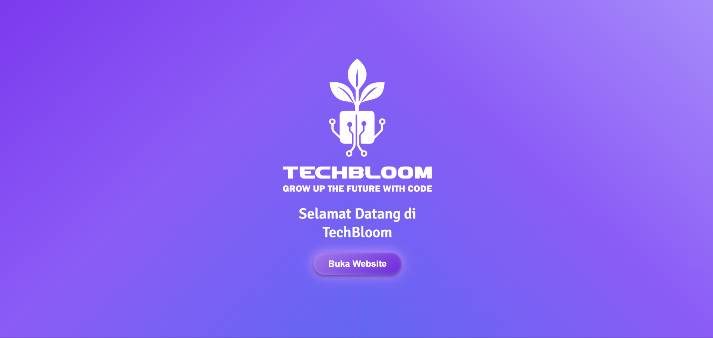
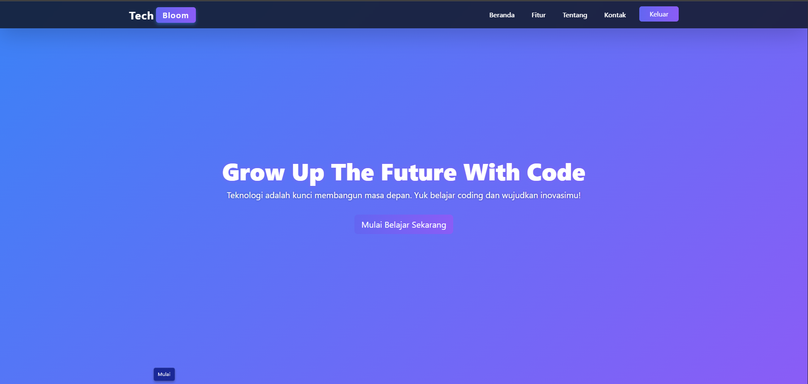

# TECHBLOOM
## UNIVERSITAS AMIKOM YOGYAKARTA

## Anggota Tim  
* Ketua : Rahmat Nur Hasan  
* Anggota : - (Individu)

## Deskripsi Karya  
**TechBloom** adalah sebuah website edukatif yang saya rancang dengan tujuan mengajak anak-anak muda untuk mulai mengenal dan belajar coding sejak dini.
Website ini saya buat sebagai respon terhadap tema lomba **“Grow Up The Future with Code”**, dengan mengambil subtema **Pendidikan Teknologi**. Saya percaya bahwa teknologi bisa tumbuh dan berkembang layaknya bunga (jika dipelihara dengan edukasi sejak awal).

---

### Tujuan TechBloom  
- Menyediakan platform yang bisa menginspirasi belajar teknologi.  
- Menumbuhkan semangat berpikir logis dan kreatif melalui coding.  
- Menyajikan informasi teknologi dengan cara visual, ringan, dan menyenangkan.  

---

### Manfaat TechBloom  
- Membantu pelajar memahami konsep teknologi lewat visual dan animasi.  
- Menjadikan pengalaman belajar coding lebih interaktif dan menarik.  
- Menghubungkan dunia edukasi dengan teknologi masa depan.  
- Menghadirkan tampilan profesional yang tetap ramah untuk pemula.

---

### Kenapa Saya Membuat TechBloom?  
Saya ingin coding terasa lebih dekat, lebih mudah dimulai, dan tidak membingungkan.  
TechBloom didesain dengan tampilan responsif, animasi halus, serta konten yang cocok untuk pelajar dari SMP, SMA, sampai mahasiswa.  
Teknologi yang digunakan antara lain: HTML5, CSS3, Bootstrap 5, dan animasi AOS.  
Semua dibuat dengan pendekatan aksesibel dan mobile-friendly.

---

Saya harap, TechBloom bisa jadi langkah kecil yang berdampak untuk memotivasi generasi muda agar tumbuh bersama teknologi.


<p align="center">
  
</p>

---

#  TechBloom – Grow Up The Future With Code

Selamat datang di **TechBloom!**  


Platform web buat ngenalin teknologi ke anak muda dengan cara yang asik, interaktif, dan gampang dimengerti.
Proyek ini dibuat sama **Hasan** buat lomba **UKM Cyber Design Competition (UCDC) 2025**, bawa tema:

> **"Grow Up The Future With Code"**

---


##  Apa yang Membuat TechBloom Menarik?

-  **Desain Modern & Responsif**  
  Tampilan clean, elegan, bisa diakses dari HP atau laptop. Ada animasi kece juga biar makin hidup.
-  **Pengenalan Teknologi Terkini**  
  Dari Artificial Intelligence sampai UI/UX Design  simpel dan mudah dimengerti.
-  **Konten Edukasi yang Ringan namun Bermakna**  
  Cocok buat pemula, pelajar, atau siapa aja yang pengen kenal dunia teknologi.
-  **Tim Kreatif & Testimoni Nyata**  
  Mengenal sosok di balik proyek dan mendengar suara dari pengguna yang sudah mencoba TechBloom.
-  **Formulir Kontak Interaktif**  
  Memudahkan pengguna memberikan kritik, saran, atau bertanya langsung dari halaman web.

---

##  Fitur Teknologi Utama

| Teknologi | Penjelasan |
|----------|------------|
|  **Internet of Things** | Koneksi dunia nyata ke alat digital yang smart.. |
|  **Web Development** | Bikin website & aplikasi kekinian.. |
|  **Sensor Otomatis** | Alat yang bisa deteksi gerakan, radar, dll.. |
|  **Cyber Security** | Cara biar data & sistem aman dari hacker.. |
|  **Augmented Reality** | Gabungin dunia nyata & digital buat belajar lebih seru. |
|  **UI/UX Design** | Bikin tampilan & pengalaman pengguna yang kece. |
|  **Cloud Computing** | Simpen & akses data lewat cloud, lebih efisien. |

---

## Tema Lomba

**UCDC 2025 - Grow Up the Future with Code**  
Subtema: **Pendidikan Teknologi**
## Screenshot Website
<p align="center">
  
  
</p>

---

##  Teknologi yang Dipakai

TechBloom dibangun pakai teknologi web yang up-to-date:

- HTML5 & CSS3
- Bootstrap 5 & Tailwind CSS
- JavaScript + AOS (Animate on Scroll)
- Google Fonts & Bootstrap Icons

Dibikin dengan fokus ke **aksesibilitas**, **responsivitas**, dan **cepat dibuka**.


---

## 🧑‍💻 Dibuat Oleh

- **Rahmat Nur Hasan** - Frontend Developer & Desainer

---
<p align="center">
  
</p>

---
##  Struktur Folder

```bash
TechBloom/
├── index.html                
├── dashboard.html                
├── assets/
│   ├── html/                  
│   ├── css/                  
│   ├── js/                   
│   └── img/                  
├── README.md
              


```
<p align="center">
  
</p>

## Kontributor
**Rahmat Nur Hasan**  
Peserta UCDC 2025 – Sistem Informasi  ( Tunarungu )


